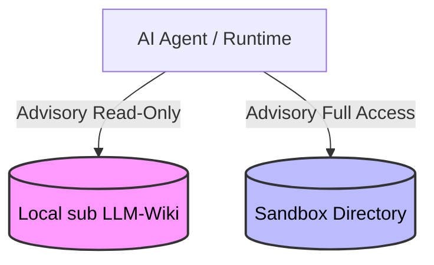

# Permission Model & Security Context

To maintain experimental integrity, the framework documents an advisory boundary between the **Read-Only Source Library** (sub LLM-Wiki) and the **Writable Sandbox**.

## 1. Local sub LLM-Wiki: Read-Only Boundary

The sub LLM-Wiki acts as a permanent reference repository. If an agent could modify this repository, it could introduce feedback loops, corrupt system states, or break the baseline for successive experimental runs.

### Permitted Library Actions

* **Inspect**: List directory contents, traverse files, and explore structure.
* **Read**: Read full file contents (`index.md`, notes, summaries).
* **Reference**: Cite pages or content, construct system prompt context, or quote excerpts in sandbox files.

### Strictly Forbidden Library Actions

* **Write**: Creating, appending, or editing files in the library directory.
* **Modify**: Overwriting or modifying existing markdown or raw references.
* **Rename/Move**: Renaming files, changing directory structures, or moving documents.
* **Delete**: Removing files, clearing logs, or resetting historical traces.

## 2. Sandbox: Writable Boundary

The sandbox is the agent's dynamic proving ground.

### Permitted Sandbox Actions

* **File System Operations**: Create, edit, rename, move, and delete files inside its designated run directory.
* **Task Execution**: Execute scripts (Python, shell, etc.) that run entirely within the sandbox boundaries.
* **Artifact Creation**: Generate dynamic files as desired, which may include logs, code files, HTML documents, or transition notes (`HELLO.md`).

## 3. Enforcement Strategy (Socio-Technical)

In the base branch scaffolding, these boundaries are advisory/interface-level only:

1. **API Utility Enforcement**: In future operational branches, safe file readers will handle listing and reading, while deliberately omitting write hooks. Any filesystem tools exposed to the agent can wrap paths to respect this division.
2. **Containment Stubs**: Robust path resolution helpers (using standard `Path.is_relative_to` checks) are planned to verify that files requested are within acceptable bounds.
3. **Downstream Isolation**: Present boundaries do not provide secure OS-level containment. Future derived branches can implement OS-level sandboxing (such as Docker containers, read-only volume mounts, or Linux chroot jails) to hard-enforce these boundaries at the system level.
