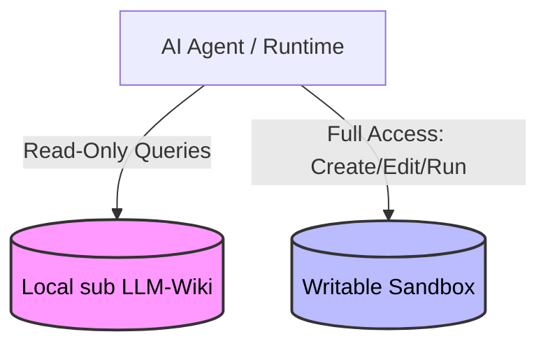

# Permission Model & Security Context

To maintain experimental integrity, the framework enforces a clear boundary between the **Read-Only Source Library** (sub LLM-Wiki) and the **Writable Sandbox**.

## 1. Local sub LLM-Wiki: Read-Only Boundary

The sub LLM-Wiki acts as a permanent information repository. If an agent could modify this repository, it could introduce feedback loops, corrupt system states, or break the baseline for successive experimental runs.

### Permitted Library Actions

* **Inspect**: List directory contents, traverse files, and explore structure.
* **Read**: Read full file contents (`index.md`, notes, summaries).
* **Reference**: Cite pages or content, construct system prompt context, or quote excerpts in sandbox files.

### Strictly Forbidden Library Actions

* **Write**: Creating, appending, or editing files in the library directory.
* **Modify**: Overwriting or modifying existing markdown or raw references.
* **Rename/Move**: Renaming files, changing directory structures, or moving documents.
* **Delete**: Removing files, clearing logs, or resetting historical traces.

## 2. Sandbox: Writable Boundary

The sandbox is the agent's dynamic proving ground. It is completely isolated on a per-run basis.

### Permitted Sandbox Actions

* **File System Operations**: Create, edit, rename, move, and delete files inside its designated run directory.
* **Task Execution**: Execute scripts (Python, shell, etc.) that run entirely within the sandbox boundaries.
* **Artifact Creation**: Generate dynamic logs, code files (`emergence.py`, `garden.py`), HTML documents, and the crowning `HELLO.md` transition notes.

## 3. Enforcement Strategy (Socio-Technical)

In the base architecture, these permissions are documented and mapped through code interfaces:

1. **API Utility Enforcement**: In `src/library.py`, safe file readers will handle listing and reading, while deliberately raising exceptions or omitting write hooks. Any filesystem tools exposed to the agent can wrap paths to enforce this division.
2. **Path Resolution Locks**: Absolute paths for the library and the sandbox are strictly separate, ensuring no overlap or relative directory-traversal escapes (e.g., `../..`) are permitted out of the sandbox.
3. **Downstream Isolation**: Future derived branches can implement OS-level sandboxing (such as docker containers, read-only volume mounts, or Linux chroot jails) to hard-enforce these boundaries at the system level.

